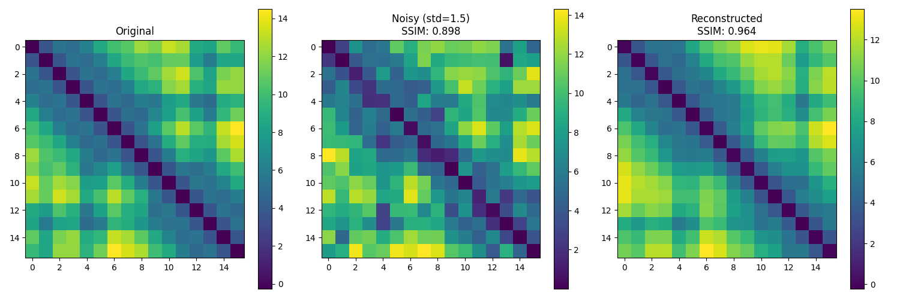

# protein-models

Exploring deep learning models for protein structure prediction. *Work in progress.*

## Overview

- Distance matrix processing and refinement using deep learning
- Structure recovery from noisy or incomplete inputs
- Latent space representations of protein structural features

The current implementation serves as a proof of concept using small (16x16) distance matrices, with plans to scale to larger and eventually full protein structures.

### Sample Reconstruction



## Next Steps

- [ ] Add convex optimization to recover 3D structure from distance matrices
- [ ] Experiment with larger pairwise distance matrices (64x64, 128x128)
- [ ] Implement increasingly complex architectures (transformers, etc.)

## Example Usage

```bash
# Run training
python examples/train_mlp_autoencoder.py
```
