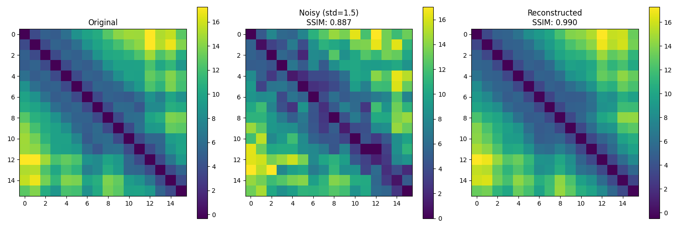

# protein-models

Exploring deep learning models for protein structure prediction.

## Overview

- Distance matrix processing and refinement using deep learning
- Structure recovery from noisy or incomplete inputs
- Latent space representations of protein structural features

The current implementation serves as a proof of concept using small (16x16) distance matrices, with plans to scale to larger and eventually full protein structures.

### Data

PDB files are downloaded and processed using the `data/download_pdbs.py` and `data/get_pairwise_matrices.py` scripts, the idea being to extract non-overlapping protein fragments and calculate pairwise distance matrices for each one.

### Sample Reconstruction

Recovery of noised protein fragment structure using an autoencoder:

